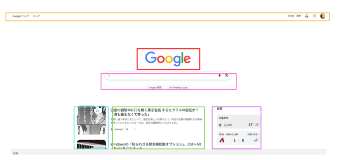
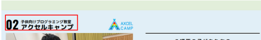
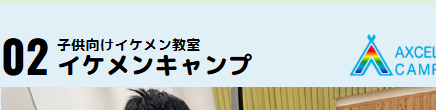
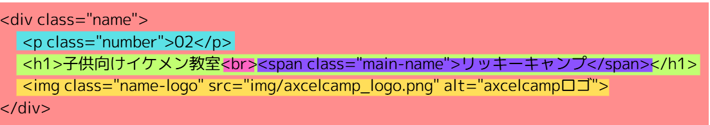
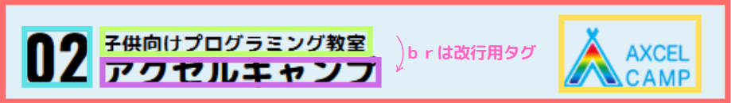

# HTML/CSS/Javascriptとは
***


## ①HTML(エイチティーエムエル)
ウェブサイトは、いくつものパーツの組み合わせでできている　
[Google](https://www.google.com/)のサイトでも、結構たくさんのパーツがある。



これらのウェブサイトは、**HTML**という文字で表されます。googleのサイトだとこんな感じ。これだけシンプルなサイトに対して、この量。ヤバいっしょ。

[google.comのソースコード](./google_sourcecode.md)

みなさんが使っているgoogle検索機能は、２万行以上のgoogleの技術の塊を使っているわけ。

なんかむずかそうに感じるかもしれないけど、もーまんたい！Googleさんの場合、裏でセキュリティー対策や、検索を高速化するために、様々な技術が使われているわけ。そのため、コードが多くなっているに過ぎません。（もちろんそのすべてが必要かつ高度な技術です）

同じHTMLをつ使ったこちらのサイトをみてみよう

[フリースペースプラウドのサイト](https://freespaceproud.com/)

このサイトのHTMLはこんな感じ。
[フリースペースプラウド　URL](./freespaceproud.md)
だいたい３００行くらい。

## ①HTMLの役割
HTMLは、**ウェブサイトのどのパーツが、どんな配置で、どのくらいのサイズでWebページに配置されるか**を決めるためのプログラミング言語です。（厳密にはプログラミング言語ではないという考えもありますが、一旦無視。[参考：HTMLはプログラミング言語ではないのか]([https://](https://zenn.dev/luma/articles/why-html-is-not-programming-language))）

例えば [さっきのサイトのHTML](./freespaceproud.md)のだいたい１００行目あたりに、こんな感じのコードがある。
```htm
<div class="name">
    <p class="number">02</p>
    <h1>子供向けプログラミング教室<br><span class="main-name">アクセルキャンプ</span></h1>
    
</div>
```

`<h1>`と書かれている行に、「子供向けプログラミング教室」「アクセルキャンプ」と書いてある。このコードが担当しているのは、webサイトのこのへん


このぶぶんのコードを↓みたいに書き換えると、当然こうなる

```htm
<div class="name">
    <p class="number">02</p>
    <h1>子供向けイケメン教室<br><span class="main-name">リッキーキャンプ</span></h1>
    
</div>
```

HTMLの　＜＞で書かれたものを**「タグ」**という。例えば上のコードで、`<div>`という部分の下に`</div>`という記号がある。これは「`<div>`というところから`</div>`までのところは一つのグループだよ！」という意味になる。
このコードには、したようなタグがあり、それぞれのページのパーツを担当している。



タグにはそれぞれの性質があり、それをパズルみたいに組み合わせて、配置などを設定していく

***

## ②CSSの役割
cssは、HTMLだけで書かれたページに色をつけたり、見やすい表示に変えておしゃれにするための言語。HTMLで大まかな表示位置などを設定して、CSSで細かい情報（文字の大きさ、色、レイアウト）
などを設定する感じ。

CSSはHTMLで書かれたものをベースにする前提で作られているので、書き方もHTMLと共通する部分がある。
｛　｝　中カッコで囲うのが特徴。

例えば、
```html
<h1>リッキーかっこいい</h1>
```
というHTMLに対して、「文字を赤くする」というCSSを充てると、こんな感じ（「当てる」といいます）

```css
h1{
    color:red;
}
```
<!-- cssをあてた結果 -->

ここでは、**h1**　というHTMLタグに対して、color(色)をred(赤)にするよ、というCSSを当てています。このように、HTMLとCSSはふか～い関係がある。

***

## ③Javascript(js)の役割
HTMLやCSSがウェブサイトの「見た目」を担当する部分とすると、Javascriptは　**「仕組み」**　を担当する部分。

「ボタンをクリックするとアニメーションが動き出す」とか、条件によって動きを変える、楽しいウェブサイトにするのに使うよ。HTMLやCSSにはできない複雑なことができるようになるぜ。

詳しくは後の章で解説するけど、Javascriptはこんな感じの見た目になるよ。
```javascript
let ricky = "ikemen";

text = document.getElementById("txt").innerText
button = documnt.getElementById("btn")

function changeText(){
    text = ricky;
}

button.addEventListenre("click", changeText)
```

# 便利ツールの紹介
## ①VSCode
## ②Codepen
https://codepen.io/
HTML, CSS, Javascriptを気軽に試せるツール
こんな感じで、いつでもどこでもHTMLなどの試し打ちができる
<!-- codepen埋め込み -->
## ③MDN Web Doc
HTMLやCSSなどのことが網羅的にいろいろ書いてあるサイト。難しいけど、困ったときに見てみるといいかも。

