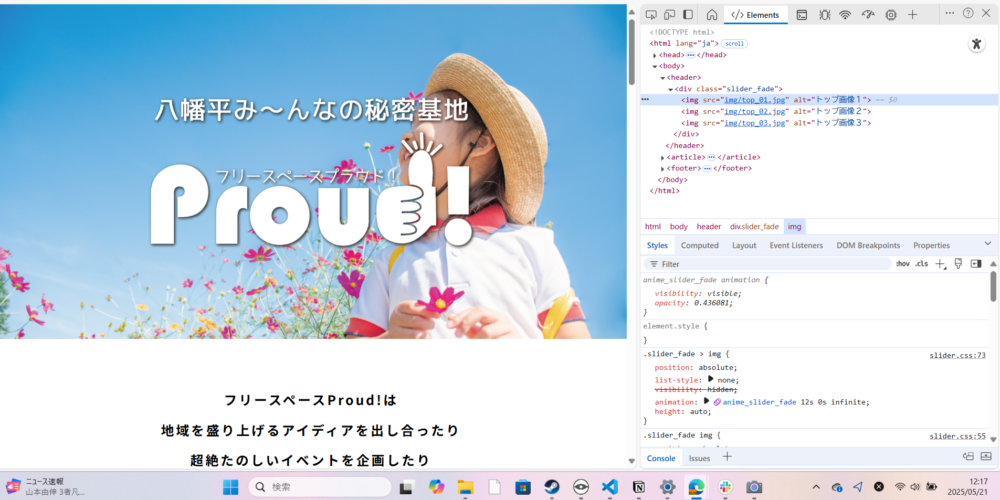
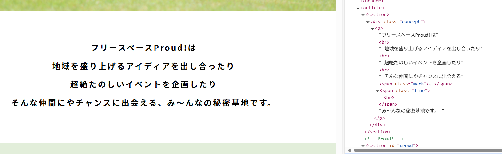
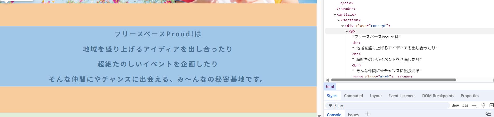
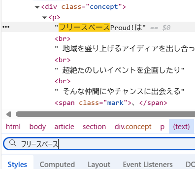
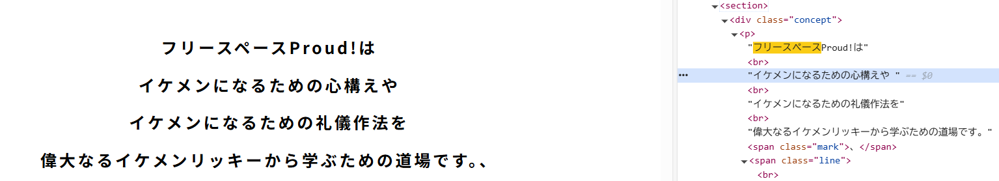

# 開発者ツール（検証ツール）で遊ぼう
***

## その前に、ブラウザについて
webブラウザはいろんな種類があり、ユーザーの好みによっていろんなブラウザをインストールすることができる。
有名なブラウザをいくつか紹介するぜ！
### ①Microsoft Edge(マイクロソフト エッジ)
micsrosoftが開発する、windowsのパソコンに標準搭載されている。CopilotというAIが使えたり、Officeソフトとの連携など、windowsのパソコンで作業するのに適したブラウザになってる。
### ②Google Chrome（グーグル　クローム）
世界で一番使われているブラウザで、googleが開発している。Androidのスマホに入ってることが多い。Googleのサービスをそのまま使える便利さから、windowsのパソコンでも、edgeが使えるのにわざわざchromeを入れたりする人がたくさんいる。
### ③safari (サファリ)
iphoneやmacOSのパソコンに標準でついているブラウザ。Apple製品との連携が得意。
### ④Firefox（ファイアーフォックス）
軽く、動作が早いブラウザとして、こだわる人によく使われるブラウザ。


## ブラウザの役割
前の項目で説明した通り、ウェブサイトはHTML,CSS,Javascriptなどのプログラミング言語でできてるんだけど、これらのプログラミング言語を見せられただけでは、一般の人にはちんぷんかんぷん

それを、皆さんが普段見るような、おしゃれなイカしたサイトにして表示するのが、webブラウザの仕事です。つまり開発者としては、webブラウザくんにちゃんと理解してもらえるHTMLなどの言語を書かなくてはいけないわけです。

初心者として勉強するレベルではあんまり起こらないけど、ブラウザの種類によってうまく表示されたりされなかったりすることもある。webサイトがうまく表示されない場合は、別のブラウザで表示してみると正しく表示されるかも。

## 開発者ツール（検証ツール）
みんなが普段見てるサイトが、どんなHTML、CSSなどでできているか、ちょっと気になるよね。実はブラウザの機能で、それを調べることができるぜ。

（※多くの人がgoogle chromeを使ってwebサイトを見るので、多くのweb開発者はgoogle chromeの検証ツールを使ってテストをしますが、アクセルキャンプのパソコンがwindows環境なので、Microsoft Edgeの開発者ツールを使っていきます。まぁだいたい似たようなもんです。）

今回はフリースペースプラウド（ https://freespaceproud.com/ ）　のサイトのHTMLを見てみよう。URLをクリックして、そのサイト内で右クリックをして、「開発者ツールで調査する」という項目をクリック。
※もしくは、F12キー

ツールをクリックすると、こんな感じの画面になる。


右上のこの部分に書いてあるのが、このサイトのHTMLです。一度に全部表示すると長くなるため、最初は一部省略して表示されているので、全部表示しちゃおう　
```html
<html lang="ja">
```
という部分を右クリックし、「expand recursively」というボタンを押すと、HTMLが全部表示される。

ちょっと下にスクロールしてみよう。左のウェブサイト部分とHTML部分を見比べてみると、同じ文字が書いてある部分がある。ここで注目してほしいのは
・基本的に、表示する順番の通りに並んでいる（上に表示するものは上に、下に表示するものは下に　※例外たくさんあり）
ということ。表示する文字や写真をタグというもので囲って、細かい位置関係や表示サイズなどを設定してるわけだけど、とりあえずいったん無視して、日本語の文章だけに注目。

### いたずらしよう！

ここで、HTMLの一部が変更できるようになっていることに気づいた？この機能を使って、このwebサイトでいたずらしちゃおう。当然、開発者ツールはwebページを書き換えて全世界に公開するものじゃなくて、あくまで「もしこのHTMLがこうだったらどう表示されるかな？」って感じでテストするためのツールだから、いたずらしても表示されるのは自分のパソコンだけ。安心していたずらしよう

まずはこの辺を変えてみようか


右側のHTML部分にマウスを乗せると、左側の該当する部分に色がついて、どの部分を示しているかがわかる


左側に書いてある「フリースペースProud！」という単語を変更したいけど、HTMLが長くてどこにあるかわからない時は、ctrl + F を押して、右下あたりにあるfilterという所に入力すると、検索できる。


<br></br>
レッツいたずら！



